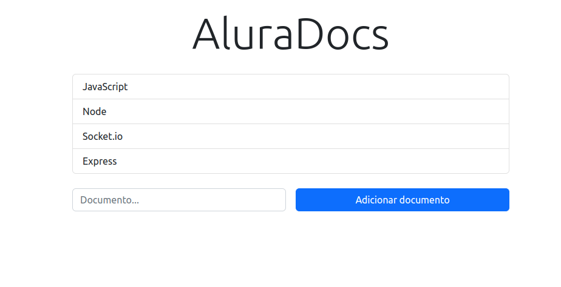

<h1>Alura Docs</h1>

<h2>Sobre o Projeto</h2>

Este projeto implementa comunicação em tempo real utilizando o protocolo `WebSockets` com o auxílio da biblioteca `Socket.IO`. A solução permite a comunicação entre um servidor ou vários clientes, aplicando diferentes métodos de interação, como o uso de Salas e o Reconhecimento de eventos do Socket.IO.

Os conceitos de `Front-end` e `Back-end` foram integrados ao longo do desenvolvimento, utilizando o `driver do MongoDB` para` Node.js`. A integração com um banco de dados `NoSQL` foi escolhida para proporcionar maior agilidade no desenvolvimento e gerenciamento dos dados.

<h2>Tecnologias Utilizadas</h2>
<ul>
  <li><strong>HTML / CSS</strong></li>
  <li><strong>JavaScript</strong></li>
  <li><strong>WebSockets</strong></li>
  <li><strong>Socket.IO</strong></li>
  <li><strong>MongoDB</strong></li>
</ul>

<h2>Visualize a aplição</h2>
